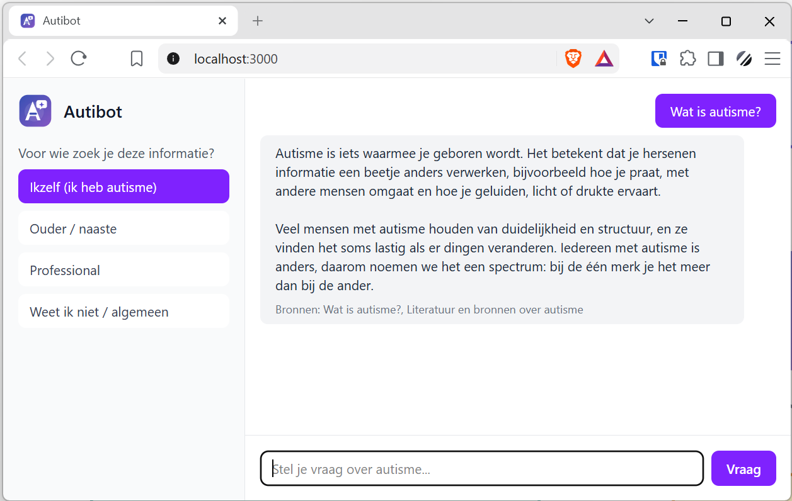

<!-- Render met: npm run slides (output: 2026-09-01-wat-is-autibot-en-waarom.html in deze map) -->

# Autibot

## Een chatbot over autisme die eerlijk durft te zeggen: "dat weet ik niet"

 

*Voor zorgprofessionals en beleidsmakers — 1 september 2026*

---

## Zo ziet Autibot eruit

<em>De gebruiker kiest eerst voor wie de vraag is; het antwoord toont meteen de gebruikte bronnen.</em>

---

## Het probleem met "gewone" AI

- Een taalmodel als ChatGPT of Claude praat vlot en zelfverzekerd
- Maar het kan ook dingen **verzinnen** — dat heet "hallucineren"
- Bij een onderwerp als autisme is dat riskant: onjuiste informatie kan onterecht geruststellen, onnodig ongerust maken, of tot verkeerde beslissingen leiden

> Vlot klinken is niet hetzelfde als kloppen.

---

## Wat Autibot anders doet

Autibot verzint niets zelf.

Het beantwoordt vragen **uitsluitend** op basis van een eigen, met zorg samengestelde kennisbank met teksten over autisme — nooit op basis van wat het model "toevallig" ooit ergens heeft opgepikt.

---

## Het verschil, in één plaatje

<svg viewBox="0 0 900 400" style="width:100%;max-width:820px;height:auto" role="img" aria-label="Vergelijking tussen een gewone AI-chatbot en Autibot">
  <defs>
    <marker id="arrowGrey" viewBox="0 0 10 10" refX="9" refY="5" markerWidth="6" markerHeight="6" orient="auto-start-reverse">
      <path d="M0,0 L10,5 L0,10 z" fill="#64748b"/>
    </marker>
    <marker id="arrowPurple" viewBox="0 0 10 10" refX="9" refY="5" markerWidth="6" markerHeight="6" orient="auto-start-reverse">
      <path d="M0,0 L10,5 L0,10 z" fill="#7E57C2"/>
    </marker>
    <linearGradient id="autibotGrad" x1="0" y1="0" x2="1" y2="1">
      <stop offset="0" stop-color="#3F51B5"/>
      <stop offset="1" stop-color="#7E57C2"/>
    </linearGradient>
  </defs>

  <!-- Linkerkolom: gewone AI -->
  <rect x="40" y="20" width="360" height="60" rx="10" fill="#64748b"/>
  <text x="220" y="56" text-anchor="middle" fill="white" font-size="21" font-family="sans-serif" font-weight="bold">Gewone AI-chatbot</text>

  <line x1="220" y1="80" x2="220" y2="128" stroke="#64748b" stroke-width="3" marker-end="url(#arrowGrey)"/>

  <rect x="40" y="130" width="360" height="80" rx="10" fill="#e2e8f0" stroke="#64748b" stroke-width="2"/>
  <text x="220" y="165" text-anchor="middle" font-size="17" font-family="sans-serif">
    <tspan x="220" dy="0">Antwoordt uit alles wat het</tspan>
    <tspan x="220" dy="24">model ooit "geleerd" heeft</tspan>
  </text>

  <line x1="220" y1="210" x2="220" y2="258" stroke="#64748b" stroke-width="3" marker-end="url(#arrowGrey)"/>

  <rect x="40" y="260" width="360" height="90" rx="10" fill="#fef3c7" stroke="#d97706" stroke-width="2"/>
  <text x="220" y="298" text-anchor="middle" font-size="17" font-family="sans-serif" font-weight="bold">
    <tspan x="220" dy="0">⚠️ Kan kloppen…</tspan>
    <tspan x="220" dy="26">…of verzonnen zijn</tspan>
  </text>

  <!-- Rechterkolom: Autibot -->
  <rect x="500" y="20" width="360" height="60" rx="10" fill="url(#autibotGrad)"/>
  <text x="680" y="56" text-anchor="middle" fill="white" font-size="21" font-family="sans-serif" font-weight="bold">Autibot</text>

  <line x1="680" y1="80" x2="680" y2="128" stroke="#7E57C2" stroke-width="3" marker-end="url(#arrowPurple)"/>

  <rect x="500" y="130" width="360" height="80" rx="10" fill="#ede9fe" stroke="#7E57C2" stroke-width="2"/>
  <text x="680" y="165" text-anchor="middle" font-size="17" font-family="sans-serif">
    <tspan x="680" dy="0">Zoekt uitsluitend in de eigen,</tspan>
    <tspan x="680" dy="24">samengestelde kennisbank</tspan>
  </text>

  <text x="680" y="236" text-anchor="middle" font-size="14" font-family="sans-serif" font-style="italic" fill="#475569">Genoeg relevante info gevonden?</text>

  <line x1="650" y1="248" x2="595" y2="286" stroke="#7E57C2" stroke-width="2" marker-end="url(#arrowPurple)"/>
  <line x1="710" y1="248" x2="765" y2="286" stroke="#7E57C2" stroke-width="2" marker-end="url(#arrowPurple)"/>

  <rect x="505" y="288" width="170" height="90" rx="10" fill="#dcfce7" stroke="#16a34a" stroke-width="2"/>
  <text x="590" y="326" text-anchor="middle" font-size="15" font-family="sans-serif" font-weight="bold">
    <tspan x="590" dy="0">Ja →</tspan>
    <tspan x="590" dy="22">Antwoord + bron 📖</tspan>
  </text>

  <rect x="685" y="288" width="170" height="90" rx="10" fill="#e0f2fe" stroke="#0284c7" stroke-width="2"/>
  <text x="770" y="326" text-anchor="middle" font-size="15" font-family="sans-serif" font-weight="bold">
    <tspan x="770" dy="0">Nee →</tspan>
    <tspan x="770" dy="22">"Dit weet ik niet"</tspan>
  </text>
</svg>

---

## Hoe het werkt, in 4 stappen

1. **Jij** geeft aan voor wie de vraag is — jezelf, een naaste, als professional, of algemeen
2. **Autibot zoekt** de passages in de kennisbank die het beste bij je vraag passen
3. Alleen als er **genoeg relevante info** gevonden is, mag het taalmodel een antwoord schrijven — en dan uitsluitend gebaseerd op die passages
4. Je krijgt het antwoord **mét de gebruikte bronnen**, zodat je het zelf kunt nalezen en checken

---

## Wat zit er onder de motorkap?

<svg viewBox="0 0 900 560" style="width:100%;max-width:780px;height:auto" role="img" aria-label="Vereenvoudigde architectuur van Autibot">
  <defs>
    <marker id="arrowGrey2" viewBox="0 0 10 10" refX="9" refY="5" markerWidth="6" markerHeight="6" orient="auto-start-reverse">
      <path d="M0,0 L10,5 L0,10 z" fill="#475569"/>
    </marker>
    <linearGradient id="autibotGrad2" x1="0" y1="0" x2="1" y2="1">
      <stop offset="0" stop-color="#3F51B5"/>
      <stop offset="1" stop-color="#7E57C2"/>
    </linearGradient>
  </defs>

  <!-- Chatvenster -->
  <rect x="300" y="20" width="300" height="70" rx="10" fill="#e0e7ff" stroke="#4338ca" stroke-width="2"/>
  <text x="450" y="50" text-anchor="middle" font-size="18" font-family="sans-serif" font-weight="bold">💬 Chatvenster</text>
  <text x="450" y="72" text-anchor="middle" font-size="13" font-family="sans-serif">waar jij typt en het antwoord ziet</text>

  <line x1="450" y1="90" x2="450" y2="158" stroke="#475569" stroke-width="3" marker-end="url(#arrowGrey2)"/>
  <circle cx="450" cy="124" r="14" fill="#475569" stroke="white" stroke-width="2"/>
  <text x="450" y="129" text-anchor="middle" fill="white" font-size="15" font-family="sans-serif" font-weight="bold">1</text>

  <!-- Regisseur -->
  <rect x="270" y="160" width="360" height="80" rx="10" fill="url(#autibotGrad2)"/>
  <text x="450" y="193" text-anchor="middle" fill="white" font-size="18" font-family="sans-serif" font-weight="bold">🧭 Regisseur</text>
  <text x="450" y="215" text-anchor="middle" fill="white" font-size="13" font-family="sans-serif">bewaakt de volgorde en de regels</text>

  <line x1="370" y1="240" x2="270" y2="308" stroke="#475569" stroke-width="2" marker-end="url(#arrowGrey2)"/>
  <circle cx="320" cy="274" r="14" fill="#475569" stroke="white" stroke-width="2"/>
  <text x="320" y="279" text-anchor="middle" fill="white" font-size="15" font-family="sans-serif" font-weight="bold">2</text>

  <line x1="530" y1="240" x2="640" y2="308" stroke="#475569" stroke-width="2" marker-end="url(#arrowGrey2)"/>
  <circle cx="585" cy="274" r="14" fill="#475569" stroke="white" stroke-width="2"/>
  <text x="585" y="279" text-anchor="middle" fill="white" font-size="15" font-family="sans-serif" font-weight="bold">4</text>

  <!-- Zoeker -->
  <rect x="100" y="310" width="300" height="80" rx="10" fill="#ccfbf1" stroke="#0d9488" stroke-width="2"/>
  <text x="250" y="343" text-anchor="middle" font-size="17" font-family="sans-serif" font-weight="bold">🔎 Zoeker</text>
  <text x="250" y="365" text-anchor="middle" font-size="13" font-family="sans-serif">vindt passende tekstfragmenten</text>

  <!-- Taalmodel -->
  <rect x="490" y="310" width="320" height="90" rx="10" fill="#fef3c7" stroke="#d97706" stroke-width="2"/>
  <text x="650" y="340" text-anchor="middle" font-size="17" font-family="sans-serif" font-weight="bold">✍️ Taalmodel</text>
  <text x="650" y="361" text-anchor="middle" font-size="13" font-family="sans-serif">schrijft het antwoord — pas als er</text>
  <text x="650" y="378" text-anchor="middle" font-size="13" font-family="sans-serif">genoeg bronmateriaal is</text>

  <line x1="250" y1="390" x2="250" y2="458" stroke="#475569" stroke-width="2" marker-end="url(#arrowGrey2)"/>
  <circle cx="250" cy="424" r="14" fill="#475569" stroke="white" stroke-width="2"/>
  <text x="250" y="429" text-anchor="middle" fill="white" font-size="15" font-family="sans-serif" font-weight="bold">3</text>

  <!-- Kennisbank -->
  <rect x="100" y="460" width="300" height="80" rx="10" fill="#e2e8f0" stroke="#475569" stroke-width="2"/>
  <text x="250" y="493" text-anchor="middle" font-size="17" font-family="sans-serif" font-weight="bold">📚 Kennisbank</text>
  <text x="250" y="515" text-anchor="middle" font-size="13" font-family="sans-serif">de zorgvuldig gekozen autisme-teksten</text>
</svg>

<em>Volgorde: eerst zoeken (1–3), pas dán mag het taalmodel schrijven (4).</em>

---

## De belangrijkste veiligheidsklep

Geen passende informatie gevonden? Dan wordt het taalmodel niet eens aangeroepen.

> "Dit weet ik niet op basis van mijn bronnen."

Liever eerlijk **"ik weet het niet"**, dan een overtuigend klinkend maar verzonnen antwoord.

---

## Waarom dan niet gewoon ChatGPT of Copilot?

- 🔍 **Gecureerde bronnen** in plaats van "heel het internet"
- 📖 **Elk antwoord toont zijn bron** — controleerbaar, niet zomaar te geloven op het woord
- 🎯 **Toon en focus passen zich aan** aan wie de vraag stelt
- 🔌 Het taalmodel is een **los, inwisselbaar onderdeel** — nu Claude, straks mogelijk een eigen, lokaal draaiend model
- 🔓 **Open source** (MIT-licentie) en volledig Nederlandstalig, specifiek gebouwd rond dit onderwerp

---

## Privacy: waar we nu staan, waar we heen willen

**Nu:** de demo gebruikt nog een clouddienst (Claude) om antwoorden te schrijven — wees terughoudend met persoonlijke details.

**Doel:** op termijn een zelf gehost model, zodat gevoelige vragen het eigen systeem niet hoeven te verlaten, en er zo min mogelijk wordt bewaard.

---

## Waar staan we nu?

- ✅ Werkende lokale demo (TypeScript/React)
- ✅ 35 automatische tests die het gedrag bewaken
- ✅ MIT-licentie: vrij te gebruiken en door te ontwikkelen
- 📚 De kennisbank moet inhoudelijk nog verder opgebouwd worden — zelf schrijven, of wellicht beter: aansluiten bij een bestaande, betrouwbare bron (bijvoorbeeld autisme.nl)
- ⏳ Nog geen echte hosting/productieomgeving
- ⚠️ Geen vervanging voor diagnose, crisishulp of professioneel advies

---

## Kort samengevat

Autibot is geen "zomaar een AI-tool".

Het is een AI die **vastzit aan betrouwbare bronnen**, **bronnen laat zien**, zich **aanpast aan de doelgroep**, en gebouwd is om **privacy serieus te kunnen waarborgen**.

 

### Vragen of feedback? Graag!
