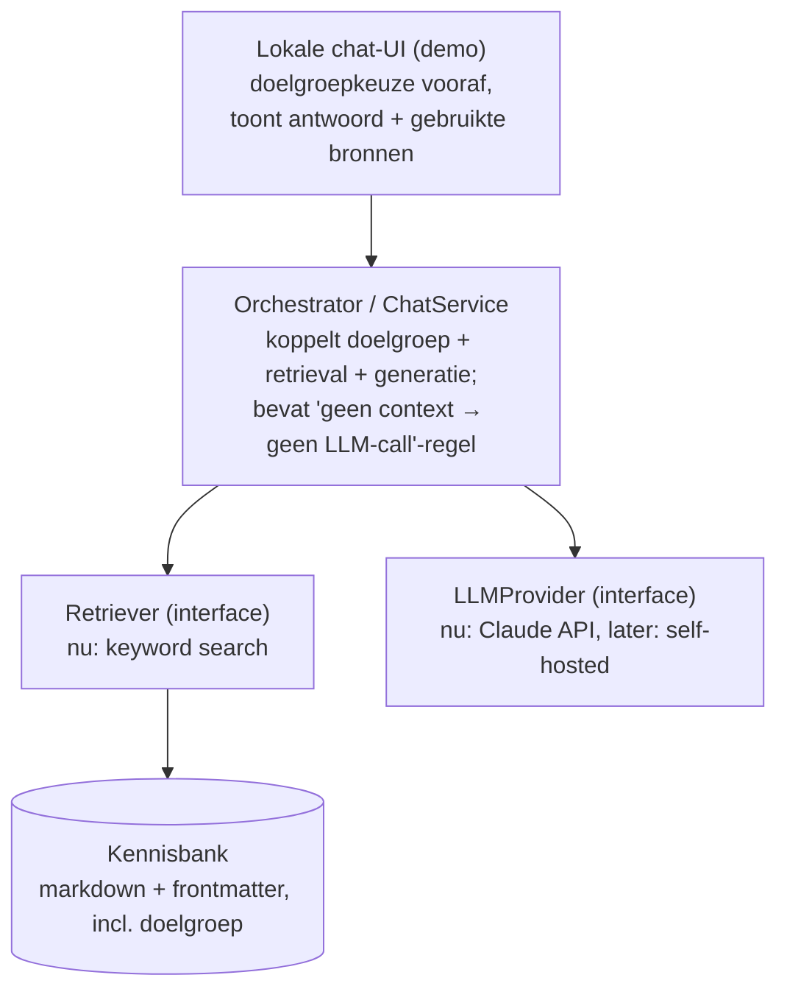

# Ontwerp: Autibot — grounded Q&A-chatbot over autisme-kennisbank

Datum: 2026-07-22
Status: Goedgekeurd, klaar voor implementatieplan

## Doel

Autibot beantwoordt vragen over ASS (Autisme Spectrum Stoornis) uitsluitend op basis van een eigen kennisbank, om hallucinatie door het onderliggende taalmodel te voorkomen. Dit document beschrijft het ontwerp van de eerste werkende versie (MVP): een lokaal draaiend prototype dat op vragen antwoordt en daarbij de gebruikte bronfragmenten toont.

## Scope van de MVP

- **Wel:** vragen beantwoorden, gegrond in de kennisbank, met zichtbare bronnen; expliciete doelgroepkeuze vooraf.
- **Niet (bewust uitgesteld):**
  - Automatisch voorstellen van vervolgvragen/gerelateerde onderwerpen.
  - Personalisatie, gespreksgeschiedenis of gebruikersprofielen.
  - Een proces voor het verzamelen/schrijven van de daadwerkelijke kennisbank-content (aparte, nog open verkenning — dit ontwerp legt alleen het *format* van de kennisbank vast).
  - Hosting/deployment op een echte site; dit prototype draait lokaal (localhost) als demo.
  - Semantische/embedding-gebaseerde retrieval (zie "Retriever" hieronder voor het pad hiernaartoe).

## Doelgroepen

De chatbot bedient alle doelgroepen (mensen met autisme zelf, ouders/naasten, professionals, breed publiek) vanuit één gedeelde kennisbank, in plaats van aparte chatbots of aparte contentsets per doelgroep. Bij de start van een gesprek kiest de gebruiker expliciet zijn/haar doelgroep uit een vaste lijst: `zelf`, `ouder-naaste`, `professional`, `algemeen`. Deze keuze bepaalt de weging bij het ophalen van kennisbank-fragmenten en de toon van het gegenereerde antwoord.

## Kennisbank-format

De kennisbank is een map met markdown-bestanden. Elk bestand heeft frontmatter met minimaal:

```yaml
---
titel: "Voorbeeldtitel"
doelgroep: [zelf, ouder-naaste, professional, algemeen]
---
```

Het proces om deze bestanden daadwerkelijk te vullen met inhoudelijk correcte, verantwoorde teksten over autisme is expliciet **buiten scope** van dit ontwerp en wordt apart uitgewerkt.

## Architectuur



### Componenten

- **Kennisbank** — markdown-bestanden met frontmatter zoals hierboven beschreven.
- **Retriever** — interface `search(vraag, doelgroep) → fragment[]`. MVP-implementatie: een keyword/full-text index (bijv. `minisearch`), opgebouwd bij opstarten uit de kennisbank-map, gefilterd/gewogen op de `doelgroep`-tag. Achter een interface gezet zodat dit later vervangen kan worden door een embedding-gebaseerde (semantische) implementatie zonder de rest van de applicatie te wijzigen.
- **LLMProvider** — interface `answer(vraag, fragmenten, doelgroep) → antwoord`. MVP-implementatie: Claude API, lage temperature. Bewust achter een interface gezet: het prototype/de demo gebruikt Claude, maar de uiteindelijke, privacygevoelige inzet is gericht op een zelf gehost open-source model op nader te kiezen infrastructuur.
- **Orchestrator** — verbindt doelgroepkeuze, Retriever en LLMProvider. Bevat de belangrijkste hallucinatie-guard: als er geen fragmenten boven een relevantiedrempel gevonden worden, wordt de LLM niet aangeroepen en volgt direct een "ik weet dit niet"-antwoord.
- **Chat-UI** — een minimale webpagina, geserveerd door een kleine lokale webserver (localhost), voor demodoeleinden: doelgroepkeuze bij start, daarna vraag/antwoord, met de gebruikte bronfragmenten (titel + verwijzing naar het md-bestand) zichtbaar zodat de gebruiker het antwoord kan verifiëren. Het concrete front-end framework (of geen framework) is een implementatiedetail en wordt in het implementatieplan bepaald.

## Dataflow

1. Gebruiker kiest doelgroep (`zelf` / `ouder-naaste` / `professional` / `algemeen`) bij start van het gesprek.
2. Gebruiker stelt een vraag.
3. Orchestrator vraagt de Retriever om top-N relevante fragmenten, gefilterd/gewogen op de gekozen doelgroep-tag.
4. **Drempelcheck:** liggen alle gevonden fragmenten onder een relevantiedrempel (of is er niets gevonden)? Dan stopt de flow hier — direct een "ik weet dit niet"-antwoord, zonder LLM-call.
5. Anders bouwt de Orchestrator een prompt: systeeminstructie ("antwoord uitsluitend op basis van onderstaande context; zeg expliciet als het antwoord er niet in staat") + de gevonden fragmenten + doelgroep-toonaanwijzing + de vraag.
6. LLMProvider (Claude, lage temperature) genereert het antwoord.
7. UI toont het antwoord samen met de gebruikte bronfragmenten (titel + verwijzing naar het md-bestand).

## Foutafhandeling / hallucinatie-mitigatie

- **Geen relevante context** → nette "ik weet dit niet"-boodschap (dataflow-stap 4), geen giswerk door de LLM.
- **LLM-call faalt/timeout** → nette foutmelding in de UI, geen crash van de chatsessie.
- **Kennisbank leeg of kapot bij opstarten** → harde, duidelijke opstartfout (fail fast) in plaats van een stille lege index die altijd "ik weet het niet" zou geven.
- **Model wijkt tóch af van de context** (ondanks system-prompt) → voor de MVP vertrouwen we op de prompt-instructie plus zichtbare bronnen als verificatiemiddel voor de gebruiker. Een automatische "grounding-check" (bijv. een tweede LLM-call die controleert of het antwoord echt uit de context komt) is een mogelijke latere verbetering, bewust niet in de MVP.

## Testen

- **Retriever:** unit tests die controleren of een voorbeeldvraag het juiste fragment oplevert, en of doelgroep-filtering werkt.
- **Orchestrator:** unit tests met een gemockte LLMProvider — met name de tak "geen context boven drempel → geen LLM-call, wel ik-weet-het-niet-antwoord".
- **Golden scenario's:** een klein setje vraag/antwoord-cases tegen een test-kennisbank: (a) een gedekte vraag → antwoord bevat verwachte info + juiste bron; (b) een ongedekte vraag → "ik weet het niet".
- **Echte LLM-output (Claude):** niet geautomatiseerd op exacte tekst getest (output varieert per aanroep); wel een handmatige smoke-test bij de demo.

## Techniek

- **Taal/stack:** TypeScript/Node.js.
- **Deployment:** lokale demo (localhost) — geen hosting, domein of productie-overwegingen in deze fase.
- **Licentie:** MIT (zie `LICENSE`), bewust gekozen om vervolgontwikkeling niet te belemmeren.

## Openstaande vervolgstappen (buiten dit ontwerp)

- Proces en bronnen voor het vullen van de kennisbank met daadwerkelijke autisme-content.
- Vervolgvraag-suggesties op basis van gerelateerde kennisbank-content.
- Eventuele overstap naar embedding-gebaseerde retrieval, mocht keyword-search onvoldoende blijken.
- Overstap van Claude API naar een zelf gehost open-source model via een lokale lemonade-server. Hier hoort onderzoek bij naar welk model daar geschikt voor is, en een test of dat in de praktijk werkbaar is (snelheid, kwaliteit) op de eigen laptop van de ontwikkelaar.
- Hosting/deployment buiten de lokale demo.

Belangrijke architectuurkeuzes uit dit ontwerp worden na goedkeuring vastgelegd als losse ADR's in `adr/` (zie `adr/0001-architectuurbeslissingen-vastleggen-met-adrs.md`).
