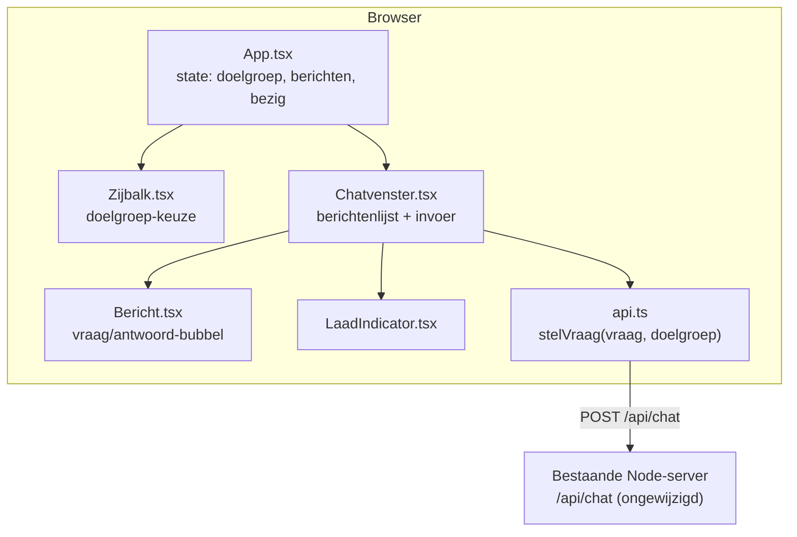

# Ontwerp: React/Vite/Tailwind chat-UI voor Autibot

Datum: 2026-07-23
Status: Goedgekeurd, klaar voor implementatieplan

## Doel

De huidige minimale vanilla-HTML/JS chat-interface van Autibot vervangen door een React-gebaseerde UI met een ChatGPT-achtige look (zijbalk, berichten-bubbels, invoerbalk onderaan), gebouwd met Vite en Tailwind CSS. Dit is uitsluitend een visuele/front-end herbouw: de backend (Kennisbank, Retriever, Orchestrator, ClaudeProvider, het `/api/chat`-endpoint) blijft functioneel en qua contract volledig ongewijzigd.

## Scope

- **Wel:** een nieuwe front-end in React + Vite + Tailwind CSS, met dezelfde functionaliteit als de huidige UI: expliciete doelgroepkeuze, een vraag stellen, het antwoord met bronnen tonen, foutafhandeling, en een laad-indicator tijdens het wachten op Claude.
- **Niet (bewust uitgesteld of afgewezen):**
  - Wijzigingen aan Orchestrator, Retriever, ClaudeProvider, het kennisbank-format of het `/api/chat`-contract.
  - Streaming van antwoorden (woord voor woord) — expliciet buiten scope voor deze herbouw.
  - Gespreksgeschiedenis of een doorlopend gesprek dat eerdere vragen als context meeneemt — expliciet buiten scope (blijft in lijn met ADR-0002).
  - Het onthouden van de laatst gekozen doelgroep tussen sessies (bijv. via `localStorage`) — bewust stateless gehouden voor nu; kan later als kleine, losse uitbreiding.
  - Doelgroep afleiden uit een vrij getypte eerste chatvraag — expliciet afgewezen, om dezelfde reden als bij het oorspronkelijke ontwerp (ADR-0003): minder voorspelbaar en lastiger te testen dan een expliciete keuze.
  - Een component-library zoals shadcn/ui — voor de paar benodigde componenten (bubbel, zijbalk, invoerbalk, laad-indicator) weegt de installatie-/configuratieoverhead niet op tegen de tijdwinst.
  - Geautomatiseerde front-end tests — zoals ook de vorige UI, blijft verificatie handmatig in de browser; dit is een pure visuele herbouw zonder nieuw functioneel gedrag.

## Framework-keuze

| Optie | Voordeel | Nadeel |
|---|---|---|
| **React + Vite + Tailwind** (gekozen) | Bekend bij de ontwikkelaar — weegt zwaar voor een project dat zelf onderhouden moet worden. Vite is een lichte, snelle bundler zonder overhead van een full-stack framework (geen SSR/routing nodig voor één lokale pagina). Sluit aan bij de bestaande "zo min mogelijk franje"-filosofie van het project. | Voegt een build-stap toe waar er nu geen was; iets meer dependencies dan vanilla JS. |
| Next.js + bestaand template (bijv. Vercel's ai-chatbot) | Sneller de exacte ChatGPT-look en -details te pakken, grotendeels kant-en-klaar. | Zwaardere stack (routing, SSR, eigen conventies) die niet nodig is — er is al een eigen Node-backend. Meer overgenomen code om te doorgronden en te onderhouden. |
| Vanilla JS/CSS herstijlen | Geen nieuwe dependencies. | Geen React — botst met de expliciete voorkeur van de ontwikkelaar. |

Component-aanpak: alle UI-onderdelen worden zelf opgebouwd met Tailwind-classes, zonder component-library.

## Doelgroep-flow

De doelgroepkeuze (`zelf` / `ouder-naaste` / `professional` / `algemeen`, ADR-0003) wordt getoond als een permanent zichtbare selector in een zijbalk, niet als los welkomstscherm en niet als eerste chatvraag. Zolang er geen doelgroep gekozen is, is het vraagveld uitgeschakeld met een plaatshoudertekst. Deze aanpak is bewust gekozen boven een terugkerende "eerste vraag"-flow: een permanente zijbalk-selector hoeft alleen aangeraakt te worden als iemand van doelgroep wíl wisselen, wat prettiger is voor frequente gebruikers (bijv. een professional) dan een keuze die bij elk gesprek terugkomt. De keuze wordt niet tussen sessies onthouden (bewust stateless, zie Scope).

## Architectuur



## Bestandsstructuur

```
client/                        (nieuw: React-broncode, getrackt in git)
  index.html
  vite.config.ts               (build.outDir -> ../src/server/public, emptyOutDir: true)
  tsconfig.json                (eigen, met jsx/DOM-instellingen — los van het backend-tsconfig)
  src/
    main.tsx
    App.tsx
    api.ts
    types.ts                   (Doelgroep/Antwoord, bewust lokaal gedupliceerd, zie toelichting)
    components/
      Zijbalk.tsx
      Chatvenster.tsx
      Bericht.tsx
      LaadIndicator.tsx
    index.css                  (@import "tailwindcss";)

src/server/public/             (wordt bouw-output van Vite, niet meer met de hand bewerkt — voortaan gitignored)
```

`client/types.ts` dupliceert bewust de kleine `Doelgroep`/`Antwoord`-vormen uit de backend, in plaats van cross-directory te importeren tussen twee losse TypeScript-projecten (backend draait op Node, front-end in de browser — andere `lib`-instellingen, andere tsconfig-doelen). Dat contract is klein en stabiel, dus dat weegt niet op tegen de complexiteit van imports tussen twee compilatie-contexten.

## Dev-tooling

`npm run dev` start voortaan twee processen tegelijk via het `concurrently`-package:
- `vite build --watch` (bouwt bij elke wijziging automatisch naar `src/server/public/`)
- `tsx src/index.ts` (de bestaande Node-server, ongewijzigd)

`npm run typecheck` wordt uitgebreid om ook `client/` te controleren, met een eigen tsconfig (browser- i.p.v. Node-doelwit).

Nieuwe dependencies: `react`, `react-dom`, `vite`, `@vitejs/plugin-react`, `@types/react`, `@types/react-dom`, `tailwindcss` + `@tailwindcss/vite`, `concurrently`.

De huidige bestanden in `src/server/public/` (`index.html`, `app.js`) worden vervangen door Vite's bouw-output en zijn straks niet meer met de hand bewerkte broncode; die map wordt daarom aan `.gitignore` toegevoegd.

## Dataflow

1. Bij laden: geen doelgroep gekozen. De zijbalk toont de 4 opties, nog niets geselecteerd; het invoerveld is uitgeschakeld met een plaatshoudertekst ("Kies eerst een doelgroep").
2. Gebruiker kiest een doelgroep in de zijbalk → state in `App` wordt bijgewerkt → het invoerveld wordt actief.
3. Gebruiker stelt een vraag → een "Autibot denkt na..."-indicator verschijnt → `api.ts` roept `POST /api/chat` aan (ongewijzigd contract) → bij antwoord wordt het nieuwe vraag/antwoord-paar toegevoegd aan de berichtenlijst.
4. Foutmeldingen (`data.fout` uit de backend) verschijnen inline in dezelfde berichtenlijst, net als in de huidige UI.

## Foutafhandeling

- Naast de bestaande `data.fout`-afhandeling (de backend gaf een nette foutmelding terug) krijgt de `fetch`-aanroep in `api.ts` ook een `try/catch` voor het geval de server zelf niet bereikbaar is — dat ontbrak in de vanilla-JS-versie en is een kleine, vrijwel gratis verbetering.
- De doelgroep-vereiste (ADR-0003) wordt op UI-niveau afgedwongen: geen vraag mogelijk zonder gekozen doelgroep.

## Testen

Geen geautomatiseerde front-end tests, in lijn met de vorige UI. Verificatie gebeurt handmatig in de browser: doelgroep kiezen, een gedekte vraag stellen, een ongedekte vraag stellen, en het gedrag bij een serverfout controleren.
